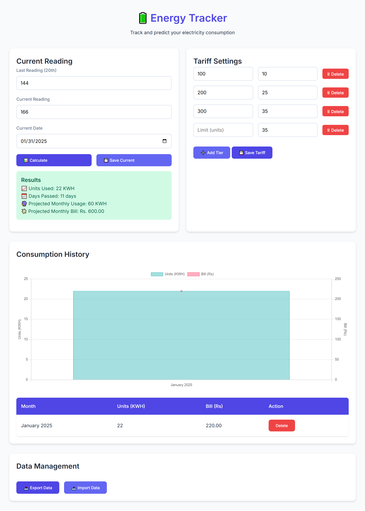

# Energy Tracker

A web application for tracking electricity consumption and calculating projected bills based on tiered pricing.

  
*screenshot of the interface*

## Features

- Calculate monthly usage projections
- Manage custom tiered electricity rates
- View consumption history with interactive charts
- Save data locally in browser storage
- Import/export data as JSON files
- Responsive mobile-friendly design

## How to Use

1. Enter meter readings:
   - Last reading (from 20th of month)
   - Current reading
   - Current date

2. Click "Calculate" to see:
   - Current usage
   - Projected monthly usage
   - Estimated bill

3. Save monthly data:
   - Automatically stored in history
   - View in table and chart formats

4. Manage pricing tiers:
   - Add/remove rate tiers
   - Configure consumption limits
   - Save tariff settings

## Installation

No installation required. Use directly in modern browsers:

1. Download files:
```bash
git clone https://github.com/yourusername/energy-tracker.git